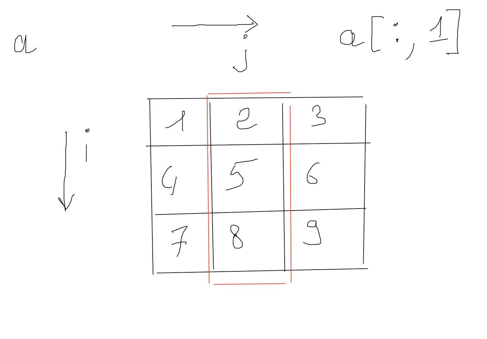
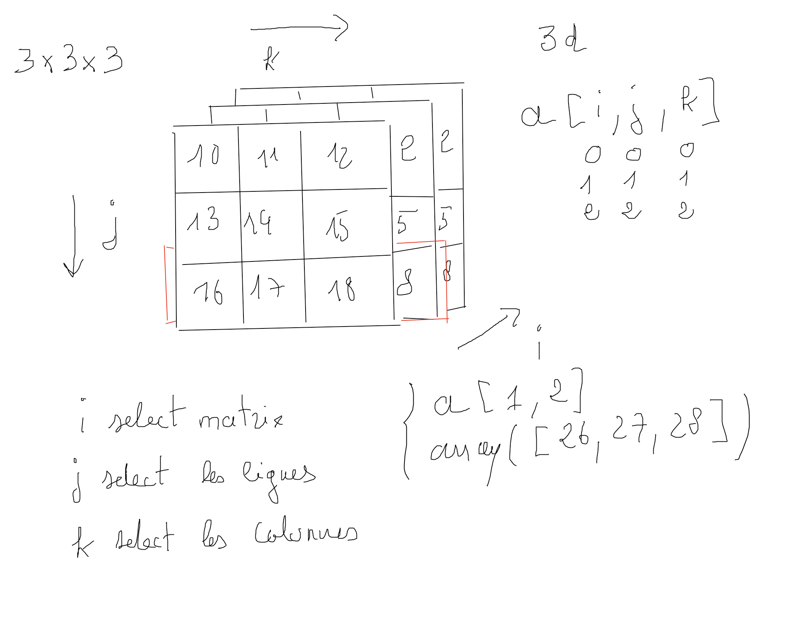
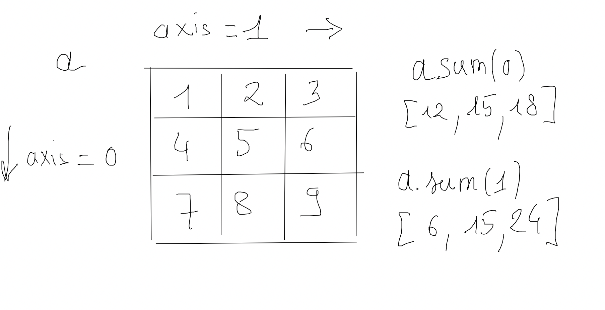
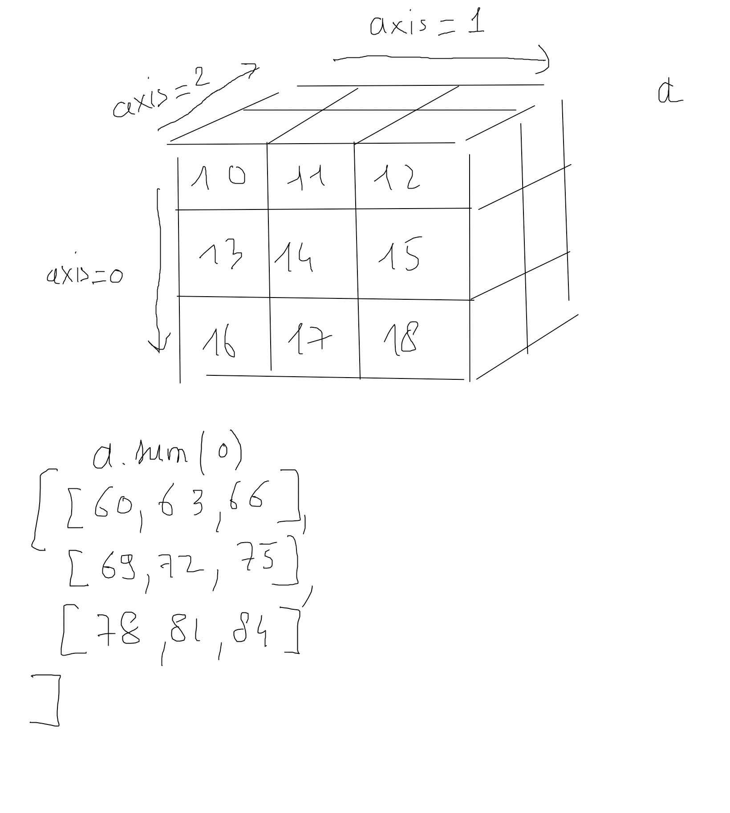

#  Introduction à Numpy les bases

Nous allons voir dans ce cours comment explorer et formater les données à l'aide de Numpy et surtout Pandas que nous verrons par la suite.

## 1. Qu'est-ce qu'une donnée (définition) ?

On peut classer les données en trois types :

- Les données structurées.

*Comme les bases de données.*

- Les données semi-structurées.

*Par exemple des fichiers JSON, HTML, XML.*

- Les données non structurées.

*Les images, les sons, les textes, ...*

## 2. Introduction à Numpy

Numpy (Numerical Python) est un package incontournable dans le domaine du Big data. Il permet de transformer un langage de programmation très classique comme Python en un langage de traitement de données.

4 notions sont fondamentales en Numpy : Ndarray, indexation avancée, vectorisation et le broadcasting.

Numpy n'est pas codé directement en Python, mais en C. Ce qui lui donne une vitesse de traitement supérieur à Python.

L'élément central dans Numpy est, parmi les 4 notions fondamentales, l'objet **array**. Il permet de stocker tout type de valeurs de manière très optimale.

Numpy permet aussi le traitement des images.

## 3. Installation

Normalement avec Jupyter ou Anaconda vous avez déjà Numpy et Pandas installés.

Pour une installation seule utilisez l'outil de gestion de dépendance pip :

```bash
pip install numpy

```

Dans un fichier de script Python on importera la librairie de manière classique :

```python
import numpy as np
```

## 4. Les tableaux dans Numpy

Les tableaux sont des structures de données propres à Numpy, très optimisés dans le stockage des données. Notons également qu'un tableau Numpy a un type unique. Les array Numpy sont également des objets mutables.

Si vous ne déterminez pas le type des éléments d'un tableau Numpy, celui-ci les convertira dans un type donné.

Vous pouvez lister tous les types possibles d'un tableau Numpy à l'aide de la commande suivante :

```python
import numpy as np

print(np.sctypes)
```

Retenez bien qu'un tableau aura un type défini et une longeur déterminée que l'on ne pourra pas changer.

Voici un tableau des types classiques dans Numpy :

- bool	Boolean (True or False)
- int8	Byte (-128 to 127)
- int16	Integer (-32768 to 32767)
- int32	Integer (-2 ** 31 to 2 ** 31 -1)
- int64	Integer (-2 ** 63 to 2 ** 63 -1)
- uint8	Unsigned integer (0 to 255)
- uint16	Unsigned integer (0 to 65535)
- uint32	Unsigned integer (0 to 2 ** 32 – 1)
- uint64	Unsigned integer (0 to 2 ** 64 – 1)
- float16 Half precision float: sign bit, 5 bits exponent, and 10 bits mantissa
- float32 Single precision float: sign bit, 8 bits exponent, and 23 bits mantissa
- float64 or float Double precision float: sign bit, 11 bits exponent, and 52 bits mantissa
- complex64 Complex number, represented by two 32-bit floats (real and imaginary components)
- complex128 or complex Complex number, represented by two 64-bit floats (real and imaginary components)

### 4.1 Type des tableaux Numpy

Nous vous conseillons de déterminer le type des données à la création d'un tableau.

Attention Numpy ne possède pas de notion Not a Number. Cela peut poser des problèmes dans la manipulation des données.

Cet exemple ne produira pas d'erreur et sera converti en float64

```python
np.array([1, 2, np.nan])
# type
np.array([1, 2, np.nan]).dtype
```

Cet exemple produira une erreur.

```python
np.array([1, 2, np.nan], dtype='int8')
```

Si vous ne déterminez pas le type des chaînes de caractères, Numpy fera une conversion silencieuse. Ci-dessous il prend du unicode et fixe la taille de la chaîne en prenant la taille de la plus longue chaîne du dataset :

```python
np.array(["Big data", "Python", "Pandas"])
# array(['Big data', 'Python', 'Pandas'], dtype='<U8')
```

On fixe la taille (préférable)

```python
np.array(["Big data", "Python", "Pandas"], dtype='<U8')
```

Dans ce dernier exemple toute chaîne de caractères qui dépasserait 8 caractères sera tronquée.

Un type peut également être "composite" comme dans l'exemple suivant :

```python

dt = np.dtype([
    ('name', np.dtype('U14')), ('grades', np.float64) 
])

dataset = np.array([
      ( "Luce du Coulon" , 12.5),
      ( "Auguste Dupont", 8.5),
      ( "Roger Le Voisi", 1.5)
], dtype=dt)


# Accéder au valeur par rapport à la clé du tuple qui définit le type composite
print(dataset['name'][1:])
```

### 4.2 Création d'un array

Importez le module Numpy comme suit :

```python
import numpy as np

```

Vous pouvez alors définir un array avec une liste Python comme suit :

```python

# Array définition tableau d'une dimension
# dtype=int8 un entier sur 8 bits -128 à 127 = 256 entiers
numbers = np.array([1,2,3], dtype='int8')

# dtype du tableau
numbers.dtype

```

Remarques importantes

Une fois le type int8 entier sur 8 bits défini, si vous insérez dans votre tableau un entier qui dépasse cet encodage, Numpy le convertira. Voyez l'exemple ci-dessous :

```python

np.array([1, 2.8, 129], dtype='int8')
# conversion de 129 en -127
# [1, 2, -127]

```

## 5. Génération de tableau à l'aide de fonctions Numpy

Une autre manière de créer ou générer un tableau Numpy est l'utilisation de fonctions comme dans les exemples ci-dessous :

```python

# Créer un tableau de 3 zéros.
np.zeros(3)
np.zeros((2,2))

# Créer un tableau de dimension 2 lignes et 3 colonnes que de 1.
np.ones((2,3))

# Remplir un tableau d'une seule valeur, tableau de 2 lignes 3 colonnes
# avec la valeur 4.5
np.full((2,3), 4.5)
```

On peut également utiliser empty pour créer un tableau "vide" d'une certaine dimension

```python
collections = np.empty(10)
# ce tableau sera rempli plus tard avec des données
```

## 6. Information sur un tableau

Vous pouvez obtenur des informations sur un tableau Numpy :

```python
# Création d'un tableau 2 lignes 8 colonnes que de 1
t = np.ones((2,8), dtype='int8')

# Nombre de dimension(s), ici 2
t.ndim

# Forme du tableau (2,8)
t.shape

# taille du tableau 16 valeurs
t.size

# type du tableau int8
t.dtype
```

## 7. Structure array définition et accès aux données

### 7.1 Accèder/modifier un/des élément(s) d'un tableau

Un tableau Numpy est **mutable**, on peut donc modifier son contenu en lui assignant d'autre(s) valeurs. Mais attention vous ne pouvez pas en ajouter.

```python
x[0,1] = 100
```

Pour un tableau d'une dimension l'accès aux données d'un tableau Numpy se fait comme pour les listes classiques que vous avez déjà vues dans le cours Python.

Quelques exemples :

```python
# creation d'un tableau 2 lignes 3 colonnes
# avec des valeurs aléatoires entières comprises entre 0 et 10
x = np.random.randint(10, size=(2,3))

# Accéder à une valeur, première ligne, première colonne
x[0,1]
```

Vous pouvez utiliser le slicing également pour accéder à des groupes de valeurs, notez bien que dans ce cas Numpy ne vous retourne pas un tableau supplémentaire, mais **une vue** du tableau :

```python
# la première colonne
x[:, 0]

# la première ligne
x[0,:]

```

Le slicing de Numpy crée donc la même référence pour un tableau :

```python

a = np.array( [ [1,2,3], [4,5,6] , [7,8,9]])

# à partir de la deuxième ligne
# à partir de la troisème colonne
b = a[1:, :2]
# array([[4, 5],[7, 8]])

a[1, 1] = 100

# même référence
print(b)
"""
array([[  4, 100],[  7,   8]])
"""
```

### Remarques importantes

Attention cependant, le type d'un tableau Numpy étant pré-défini, vous ne pouvez pas assigner dans ce tableau des valeurs d'un type différent.
Il n'existe pas de méthode append, en effet un tableau ne peut contenir plus de valeur(s) qu'il ne possède lors de sa création.

Exemple de tableau 2d :

```python
a = np.array([[1,2,3], [4,5,6], [7,8,9]])
```




- Exemples

```python
a = np.array([[1,2,3], [4,5,6], [7,8,9]])

print(a[:, 1])
# [2 5 8]

print(a[1, :])
# [4 5 6]

print(a[1])
# [4 5 6]

print(a[1, 1:])
# [5 6]

print(a[:, 1:])
"""
[[2 3]
 [5 6]
 [8 9]]
 """
```


### 7.2 les tableaux 3d

Dans un tableau 3d vous avez trois indicies : i, j, k qui représentent respectivement :

- i la matrice

- j la ligne

- k la colonne

```python

a = np.array([
       [[10, 11, 12], [13, 14, 15], [16, 17, 18]], # matrix 0
       [[20, 21, 22], [23, 24, 25], [26, 27, 28]],
       [[30, 31, 32], [33, 34, 35], [36, 37, 38]]
])
```



Quelques exemples :

```python
# première matrice
# toutes les lignes
# deuxième colonne
print(a[0, :, 1])
# [11 14 17]

# toutes les matrices
# deuxième ligne
# troisième colonne
print(a[:, 1, 2]) 
# [15, 25, 35]

# toutes les matrices
# deuxième ligne
print(a[:, 1])
# [[13 14 15]
#  [23 24 25]
#  [33 34 35]]

# toutes les matrices
# toutes les lignes
# première colonne
print(a[:, :, 0])
# [[10 13 16]
#  [20 23 26]
#  [30 33 36]]
```

## 8. sum

La fonction sum sur un tableau permet de faire la somme des lignes ou colonnes. Cette fonction possède un argument axis qui permet de préciser l'axe pour effectuer la somme :

```python
a = np.array([[1,2,3], [4,5,6], [7,8,9]])
```



Vous pouvez également utiliser cette fonction sur un tableau de dimension 3d :

```python
a = np.array([
       [[10, 11, 12], [13, 14, 15], [16, 17, 18]], # matrix 0
       [[20, 21, 22], [23, 24, 25], [26, 27, 28]],
       [[30, 31, 32], [33, 34, 35], [36, 37, 38]]
])
```



### 01 Exercice slicing

Soit x1 le tableau suivant :

1. Affichez la première ligne du tableau x1.

2. Affichez la deuxième colonne.

```python
x1 = np.array([[9, 1, 2],
       [8, 0, 2],
       [5, 1, 5]])
```

3. Faites la somme des lignes puis des colonnes.

4. Reprenez le tableax x1 et faite la somme de chaque colonne que vous placerez dans un tuple : (c1, c2, c3).

5. Même consigne mais maintenant pour les lignes : (l1, l2, l3).

Soit maintenant un tableau 3d 2x2x2

```python

x2 = array([ 
    [ [8, 4],[8, 9] ],
    [ [3, 0],[5, 0] ] 
])

```

6. Faites la somme selon l'axe axis = 0

7. Faites la somme selon l'axe axis = 1

8. Faites la somme selon l'axe axis = 2

9. Créez un nouveau tableau x3 de dimension 1 X 2 qui fait la somme totale de chaque ligne.

10. On voudrait sélectionner maintenant les deuxièmes valeurs dans les tableaux 2x2 de chaque ligne.

Indications : vous devriez trouver pour cette dernière question le tableau suivant :

```txt
array([[4, 9],
       [0, 0]])
```

## 9. Opération avec les tableaux

Vous pouvez utiliser des opérateurs arithmétiques sur des tableaux, attention au sens de ces derniers, voyez les exemples qui suivent :

- L'addition additionne terme à terme les deux tableaux Numpy :

```python

numbers1 = np.array([1,2,3])
numbers2 = np.array([1,2,3])

numbers = numbers1 + numbers2

"""
array([2, 4, 6])
"""
```

- Diviser un array divise tous les termes :

```python

# Diviser un array
n = np.array([2, 4, 6])
n/2

print(n.dtype) # int8
p = n*1.2 # un array float64 nouveau tableau 
p.dtype

print(n) # la matrice initiale n'a pas changer

"""
array([ 1.,  2.,  3.])
"""
```

Les autres opérateurs sont possibles sur les tableaux :

%, /, *, +

### 02 Exercice operator slicing

Soit le tableau suivant modifiez les lignes suivantes :

1. Dans une copie , une ligne sur 2 multipliez toutes les valeurs par 2.

2. Dans une copie, une ligne sur 3 multipliez toutes les valeurs par 3.

3. Ajoutez 100 à la dernière valeur de chaque ligne.

```python

y1 = np.array([[5, 5, 1, 6, 5],
       [7, 7, 8, 9, 6],
       [1, 7, 2, 4, 5],
       [3, 4, 7, 0, 8],
       [1, 8, 2, 0, 2]])

yy1 = np.copy(y1, copy=True)
```

Soit maintenant le tableau de dimension 5x5x5 suivant, répondez aux questions ci-dessous :

4. Pour chaque "numéro" de matrice paire et chaque ligne paire multipliez par 2 les valeurs.

5. Pour chaque matrice dont la somme des valeurs de la ligne est impaire, ajoutez 100 à toutes les valeurs de cette ligne.

6. Reprenez la matrice initiale y2 et ajoutez 1000 à la dernière valeur de chaque ligne de chaque matrice.

7. Pour chaque matrice dont la somme totale des valeurs est impaire, ajoutez 100 à toutes les valeurs de cette matrice.

```python

y2 = np.array([[[89, 26, 78, 55, 23],
        [32, 92, 86, 55, 27],
        [87, 46, 63, 43, 77],
        [27, 18, 15, 20, 65],
        [52, 75, 82,  9, 38]],

       [[78, 20, 86, 16, 31],
        [46,  3, 59,  6, 50],
        [76, 73, 41, 66, 42],
        [70, 80, 62, 58, 41],
        [41, 65, 49,  0, 79]],

       [[13,  9, 58, 35, 32],
        [80, 86, 30, 73, 18],
        [52, 73, 74,  8, 40],
        [80, 27, 26, 94,  8],
        [30, 62,  3, 35, 75]],

       [[69, 54, 24, 28, 44],
        [29, 85, 56,  7, 69],
        [13,  1, 62, 10, 66],
        [ 6,  5, 31, 78, 92],
        [11, 41, 38,  4, 67]],

       [[30, 91, 12, 10, 91],
        [65, 95, 36, 54, 35],
        [49, 96, 21,  5, 87],
        [68, 82, 90, 36, 56],
        [41, 18, 75, 39, 99]]])
```

## 10. Fonction lambda

Vous pouvez appliquer une fonction lambda sur chaque valeur d'un tableau.

```python
a = np.random.randint( 10, size = (10) )
# une promo - 20%
promo = lambda x : x * 0.8
print(promo(a))
"""
array([2.4, 6.4, 3.2, 3.2, 2.4, 6.4, 4.8, 0.8, 4. , 0. ])
"""
```

### 03 Exercice augmentation

Soit le tableau suivant appliquez une augmentation de 10% sur chaque valeur paire du tableau suivant :

```python
prices = np.array([82, 92, 89, 65, 77, 66, 69, 65, 79, 51])
```

Indication : vous pouvez appliquer une fonction lambda avec un calcul simple sur le tableau lui-même. Pour filtrer les valeurs pairs utiliser la fonction np.where de Numpy

```python

rate = lambda x : x*1.1

rate(prices)
# Dans l'exemple suivant a est un tableau a > 2 est une condtion à vérifier sur toutes les valeurs du tableau et 1 et 0 les 
# valeurs à retourner en fonction de la condition si True 1 et False 0 :
np.where( a > 2, 1 , 0)

```

### 04 Exercice minimum

Soit le tableau A suivant on cherche les valeurs minimales par ligne.

Nous aimerions à l'aide d'un script Python trouver tous les indices de tableau par ligne des minimaux et les enregistrer dans une liste de tuples comme dans l'exemple ci-dessous :

```python

A = np.array([
    [13, 22, 28, 66, 40],
    [16, 59, 37, 33, 28],
    [34, 98, 54, 48, 96],
    [13, 84, 93, 79, 76],
    [63, 50, 10, 69, 12]
])

# Liste des minimaux et leur position sur chaque ligne
minTabLine = [(0, 13), (0, 16), (0, 34), (0, 13), (2, 10)]
```

### 05 Exercice doublon

Dans le tableau suivant éliminer tous les doublons de lettres, voyez le tableau sanitize que nous aimerions avoir une fois votre script exécuté ci-dessous :

```python
a = np.array([
    ["aaabbfffhjik", "hhhkkkiooo", "hhjuuk"],
    ["rrrtttyyuuii", "rroooiiiuuu", "jjjhhhaa"],
    ["aaabbgghhh", "iiikkkooomml", "hhhiijjjuu"],
    ["hhhyyytttuu", "xxxnnnooii", "kkkjjjuuppp"],
    ["qqqfffgghhh", "qqqkkklll", "ooohhhjjj"],
])

sanitize = np.array([
       ['bfhajik', 'hiko', 'jhuk'],
       ['urity', 'urio', 'jha'],
       ['hgab', 'likmo', 'jhui'],
       ['hyut', 'xino', 'jupk'],
       ['fqhg', 'lqk', 'jho']
])
```

Indications : vous pouvez utiliser les set qui permettent d'obtenir un ensemble de valeurs uniques.

```python

print( set("aaabbfffhjik") )

```

### 06 Exercice formater

Développez un script permettant de nettoyer le dataset students pour obtenir le tableau sanitize :

```python

students = np.array([
    [  "Name: Luce du Coulon" , "phone: 201-20-30"],
    [  "Name: Auguste Dupont", "phone: 201-22-30"],
    [  "Name: Roger Le Voisi", "phone: 201-27-30"],
    [  "Name: Alexandre Lacri", "phone: 201-10-30"],
    [  "Name: Jacques Humber", "phone: 201-20-35"],
    [  "Name: Thérèse Guille", "phone: 201-20-38"],
    [  "Name: Gilles Gros-Bodin", "phone: 201-20-39"],
    [  "Name: Amélie Pires", "phone: 201-25-39"],
    [  "Name: Marcel Laporte", "phone: 201-20-39"],
    [  "Name: Geneviève Marchal", "phone: 301-20-39"]
])

santize = np.array([
       ['Luce du Coulon', '201-20-30']
       ['Auguste Dupont', '201-22-30']
       ['Roger Le Voisi', '201-27-30']
       ['Alexandre Lacri', '201-10-30']
       ['Jacques Humber', '201-20-35']
       ['Thérèse Guille', '201-20-38']
       ['Gilles Gros-Bodin', '201-20-39']
       ['Amélie Pires', '201-25-39']
       ['Marcel Laporte', '201-20-39']
       ['Geneviève Marchal', '301-20-39']
 ])

```

2. Comptez maintenant le nombre du numéro comportant le nombre 30.

Pour ce faire vous pouvez créer ce que l'on appelle un mask, c'est à dire parcourir le tableau et tester si le pattern "30" est présent dans la chaîne. Le mask devra avoir la même dimension que votre tableau. Une fois celui-ci en place vous pourrez alors l'appliquer de la manière suivante :

```python
sanitize[mask]
```

## 11. Extraire des données avec un opérateur

Vous pouvez utiliser des opérateurs de comparaison pour extraire des données d'un array; c'est très pratique lorsqu'on souhaite extraire uniquement une partie des données selon un critère :

```python
a = np.array([1, 2, 3, 4, 5, 6 ,7])
print(a[ a > 3])
# array([4, 5, 6, 7])
```

Vous pouvez utiliser l'opérateur modulo pour extraire des valeurs paires d'un array par exemple :

```python

a = np.array([9,100,7, 88, 90, 11, 2 ])

a[ a % 2 == 0]
# array([100,  88,  90,   2])

```

Extraire les nombres supérieurs à 2 :

```python

a = np.array([9,100,7, 88, 90, 11, 2 ])

b = a > 2
# array([
# True,  True,  True,  True,  True,  True, False], dtype=bool)

```

Puis il faut appliquer le mask (indexation avancée) :

```python

a[b]
# array([  9, 100,   7,  88,  90,  11])

```

Comparaison de deux tableaux Numpy :

```python


# Ou comparer deux array de même dimension
a = np.array([1, 2, 3, 4, 5, 6 ,7])
b = np.array([10, 20, 3, 4, 5, 6 ,7])
b > a
# array([ True,  True, False, False,
# False, False, False], dtype=bool)
```

Vous pouvez également compter avec un mask :

```python
np.sum( a > 2 )
```

En utilisant la méthode all de Numpy vous pouvez appliquer une comparaison totale sur les valeurs du tableau :

```python
# Retourne True si tous les éléments sont supérieur à 2
# et False sinon.
np.all(a > 0)
```

Si vous devez construire une proposition avec plusieurs assertions attention à la priorité des opérateurs. Le & est prioritaire par rapport à l'opérateur de comparaison :

```python
a = np.arange(1, 100) 

mask1 = (a > 0) & (a < 10)

mask2 = (a > 0) & (a < 10) | (a > 12) & ( a < 100 >)

a[mask2]
"""
array([ 1,  2,  3,  4,  5,  6,  7,  8,  9, 
       13, 14, 15, 16, 17, 18, 19, 20, 21
       22, 23, 24, 25, 26, 27, 28, 29])
"""
```

Vous pouvez créez un tableau à partir d'un autre en dupliquant ses valeurs :

```python
a = np.arange(1, 10)
b = np.arange(1, 10)

# Retourne un tableau de boolean
print( a == b )

# retourne True ou False
print(np.all(a == b))
```

Attention, aux opérateurs binaires & et | utilisés ici, cela ne change rien pour nous, vous devez mettre des parenthèses et continuez à les utiliser comme nous l'avons fait dans le cours. 

Si vous vous intéressez à ce qu'est un opérateur binaire voici une explication de son principe d'utilisation :

Pour un & si c'est 1 et 1 alors c'est 1 et sinon 0 comme dans la table de vérité pour le connecteur &&.
```python
a = 10 # 1010 (binaire)
b = 4 #  0100 

# Affiche 0
print( a &  b ) 

a = 12 # 1100
b = 8 #  1000

# Affiche 8 représentation décimal de 1000 pour a & b 
print( a & b)

```

### 07 Exercice phrase word

L'objectif de cet exercice est de déterminer la première position dans chaque ligne du tableau **dataNumbers** de la séquence **w** ci-dessous.

1. Créez une fonction **search_word** qui prendra un seul paramètre : une liste d'entiers. Cette fonction retournera la position de la première occurence de la séquence **w**.

```python
w = [1, 2, 3, 4]
line =  [ 6,  9,  1,  2,  3,  4,  3,  1,  4,  3,  9,  6,  2,  2]
```

2. Utilisez maintenant cette fonction avec les données du tableau **dataNumbers**. Trouvez toutes les positions des séquences dans chacune des lignes du tableau, si la séquence n'existe pas retournez None. Pour appliquer une fonction à un tableau Numpy vous utiliserez la fonction **apply_along_axis**, voyez l'exemple ci-dessous :

```python

# paramètres : fonction, axis = 0, 1, dataset
np.apply_along_axis(search_word, 1, dataNumbers)
```

Vous retournerez un tableau de dimension 1 avec les positions de chacune des séquences si elles existent et None sinon.

```python

w = [1, 2, 3, 4]

dataNumbers = np.array([
       [ 6,  3,  3,  7,  7,  4,  7,  8,  5,  3,  7,  8,  4,  2],
       [ 6,  9,  1,  2,  3,  4,  3,  1,  4,  3,  9,  6,  2,  2],
       [-1, -1, -1, -1, -1, -1, -1, -1, -1, -1, -1, -1, -1, -1],
       [ 4,  9,  2,  1,  1,  2,  3,  4,  3,  1,  9,  8,  2,  6],
       [ 3,  2,  9,  9,  2,  3,  6,  9,  8,  2,  1,  2,  3,  4],
       [ 1,  4,  1,  2,  3,  4,  4,  5,  8,  8,  1,  5,  7,  1],
       [ 1,  4,  3,  8,  2,  1,  2,  3,  4,  3,  9,  3,  5,  8],
       [ 7,  8,  8,  5,  1,  8,  3,  3,  6,  1,  2,  3,  4,  7],
       [-1, -1, -1, -1, -1, -1, -1, -1, -1, -1, -1, -1, -1, -1],
       [ 7,  7,  1,  6,  1,  2,  3,  4,  9,  2,  4,  4,  5,  9],
       [ 5,  6,  6,  2,  3,  7,  1,  9,  9,  5,  1,  2,  3,  4],
       [ 7,  7,  2,  3,  3,  7,  9,  4,  3,  9,  1,  1,  1,  1],
       [ 6,  1,  2,  3,  4,  5,  5,  3,  1,  3,  1,  2,  3,  4]
       ],dtype=int8
)

```

### 08 Exercice température

Nous avons relevé des températures au mois de Janvier. Répondez aux questions suivantes :

1. Donnez toutes les températures qui sont supérieures à 0.

2. Comparez les températures supérieures et inférieures à 0.

3. Donnez le pourcentage des températures positives sur le mois.

4. Créez un tableau days pour les jours du mois et donnez les jours pour lesquels la température était supérieure à 0.

5. Donnez toutes les températures supérieures à 0 à partir du dixième jour du mois.

6. Remplacez maintenant les températures négatives par la moyenne des températures positives.

```python
january = np.array([-2,  5, -5,  6, -2,  0,  6,  2,  8,  0,  6, -1,  3,  3,  7,  0, -5,
        7,  4,  7,  8, -1,  5, -2,  3, -3, -2,  7,  8,  4,  2])
```

### 09 Exercice multiple de 11

Soit le tableau suivant 20X20, c'est un tableau random d'entiers de 1 à 200. Nous souhaitons l'explorer pour rechercher tous les multiples de 11.

```python
dataset = np.random.randint(1, 200, size=(20, 20) )
```

1. Générez une liste y de tous les multiples de 11 inférieurs à 200.

2. En utilisant la fonction Numpy suivante récupérez tous les multiples de 11 du dataset. Auditez chaque ligne pour savoir combien il y a de multiple de 11 par ligne. 

```python
np.isin(dataset, y)
```

3. Supprimez toutes les lignes comportant au moins un multiple de 11.


## 12. Supprimer des lignes avec des données manquantes

Souvent dans les datasets des données manquent. Elles ont le type NaN dans Numpy. Pour qu'un tableau Numpy puisse contenir ce type de données manquantes il doit avoir le type float64 :

```python

# Sans définir le type du tableau celui-ci aura le type float64
x = np.array([[1,2,3], [4,5,np.nan], [7,8,9]])

print(x.dtype)
# float64

```

La méthode np.isnan suivante permet de créer un masque sur les données manquent du tableau et permet de mettre en place une stratégie pour supprimer des lignes avec des données manquantes.

```python
np.isnan(x)
"""
[[False False False]
 [False False  True]
 [False False False]]
"""
```

## Révisions

### 10 Exercice slicing

Soit m le tableau suivant :

1. Affichez les multiples de 3 de la première ligne du tableau m.

2. Affichez la deuxième colonne et faite la somme des nombres pairs de cette colonne.

```python
m = np.random.randint(1, 5, (10,10))
```

3. Faites la somme des lignes puis des colonnes qui contiennent au moins un 1.

4. Reprenez le tableax m et faite la somme de chaque colonne que vous placerez dans un tuple.

5. Même consigne mais maintenant pour les lignes.

6. Faites la somme des valeurs paires de la matrice.

7. Faites la somme des valeurs paires des colonnes.

8. Calculez la moyenne des valeurs et l'écart type.

9. Créez un nouveau tableau à partir des valeurs paires de la matrice m

### 12 circular algo (**)

Créez une fonction circular qui prend en paramètre un entier n et renvoie une matrice de taille n*n et calcule toutes les permutations circulaires du cycle de longueur n, voyez l'exemple ci-dessous :

```python

circular(10)

"""
[[ 1  2  3  4  5  6  7  8  9 10]
 [ 2  3  4  5  6  7  8  9 10  1]
 [ 3  4  5  6  7  8  9 10  1  2]
 [ 4  5  6  7  8  9 10  1  2  3]
 [ 5  6  7  8  9 10  1  2  3  4]
 [ 6  7  8  9 10  1  2  3  4  5]
 [ 7  8  9 10  1  2  3  4  5  6]
 [ 8  9 10  1  2  3  4  5  6  7]
 [ 9 10  1  2  3  4  5  6  7  8]
 [10  1  2  3  4  5  6  7  8  9]]

"""

```