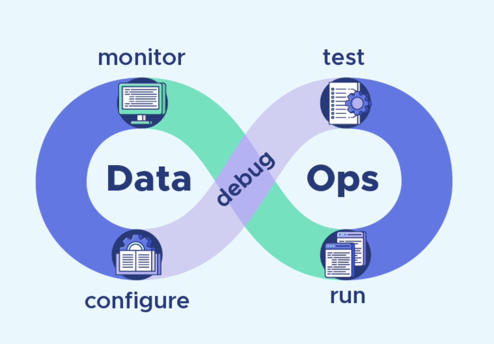

# DataOps

Rappel :

Le DataOps est une méthodologie combinant la Data Science et le DevOps pour l’analyse de données.

C'est une méthodologie agile, **orientée-processus** pour l’analyse de données.

Constituer une équipe DataOps commence par l'identification des projets nécessitant des développements exigeants en données. 

Vous avez besoin d'expert des données dans l'équipe DataOps.

Quelle que soit sa composition, une équipe DataOps doit intégrer plusieurs experts de la données. 

Les experts potentiels des données sont : développeur, base de données & réseaux (infrastructure), statisticiens, spécialiste des données (dans le cas du Covid des infectiologues), RGPD, ...

## Le projet analyse de l'épidémie du Covid

Par équipe de 3 en utilisant la méthode AGILE vous analyserez les données du Covid 19. Vous devez mettre en évidence la pertinence des principaux vaccins ARN dans le traitement de cette épidémie. 

Les attentes : 

- En une page maximum, rédigez un document qui présente l'équipe, les modèles de données utiliser, et la méthodologie d'organisation (AGILE).

- Les scripts pour l'ETL

- Le/les graphiques.

Les outils d'organisation

- Trello ou Notion.so, Notebook, Git, Python et Matplolib.

- Cycle du traitement des données :

1. Extraction / nettoyage données manquent, normaliser les données

2. Création d'un modèle 

3. Analyse graphique

4. sauvegarde des analyses fichiers ou base de données

Rmq : *comme ces données évoluent vous devez intégrer une notion de temps de réactualisation des données dans votre analyse.*

Sources des données

https://raw.githubusercontent.com/opencovid19-fr/data/master/dist/chiffres-cles.json