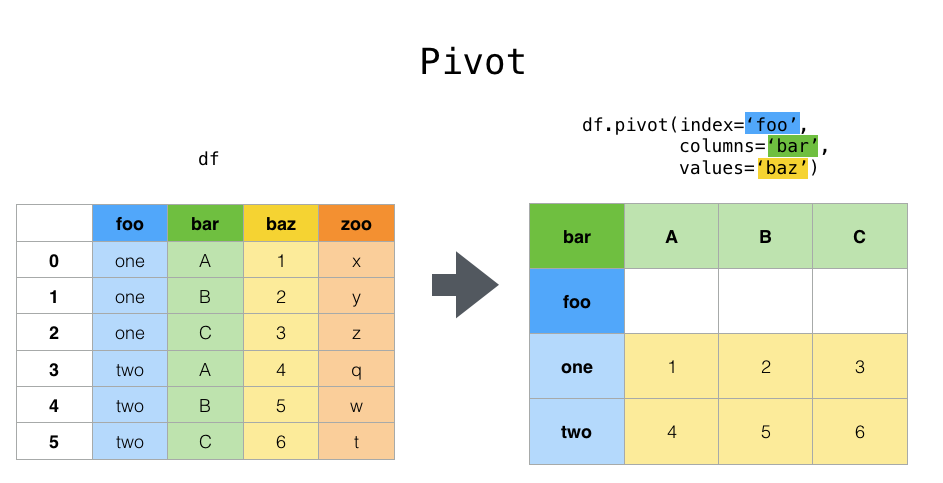

# DataOps

Rappel :


Le DataOps est une méthodologie combinant la Data Science et le DevOps pour l’analyse de données.

C'est une méthodologie agile, **orientée-processus** pour l’analyse de données.

Constituer une équipe DataOps commence par l'identification des projets nécessitant des développements exigeants en données. 

Vous avez besoin d'expert des données dans l'équipe DataOps.

Quelle que soit sa composition, une équipe DataOps doit intégrer plusieurs experts de la données. 

Les experts potentiels des données sont : développeur, base de données & réseaux (infrastructure), statisticiens, spécialiste des données (dans le cas du Covid des infectiologues), RGPD, ...

## Le projet analyse des prénoms Américains 

Lisez bien le document, dans la denière partie on vous propose des questions pour avancer sur la technique, suivez les.

### Organisation des équipes

Par équipe de 3 en utilisant la méthode AGILE vous analyserez ces données. Vous étudierez la variété des prénoms durant cette période.

### Présentation 

L'administration américaine de la sécurité sociale (USSSA ou SSA) a rendu publique les données sur la fréquence des prénoms attribués aux bébés depuis 1880 jusqu'en 2018.

Récupérez les sources names.zip à l'adresse suivante : [baby](https://www.ssa.gov/oact/babynames/limits.html), puis dézippez celle-ci dans un dossier data à la racine de vos notebook.


### Les attentes 

Vous devez nous donner un document écrit et un PDF (partie document), notez bien vos noms, prénoms et classe dans chacun des documents rendus.

#### Rédactions/livrables

En une page maximum, rédigez un document qui présente l'équipe, les modèles de données utiliser, et la méthodologie d'organisation (AGILE).

En 2 pages maximum avec les graphiques vous rédigerez les processus utilisés pour réaliser cette étude.

Puis vous donnerez en quelques lignes vos conclusions générales sur l'étude.

#### Processus techniques

- Les scripts pour l'ETL

- Le/les graphiques.

#### Les outils d'organisation

- Trello ou Notion.so, Notebook, Git, Python et Matplolib.

- Cycle du traitement des données :

1. Extraction / nettoyage données manquent, normaliser les données

2. Création d'un modèle 

3. Analyse graphique

4. sauvegarde des analyses fichiers ou base de données

5. Dépendances Python (au miminum) 

```python
import pandas as pd
import numpy as np
import matplotlib.pyplot as plt
```

#### Analyse guidée (processus technique)

1. Récupérez le fichier yob1880.txt et créez un DataFrame names1880 à partir de ces données. Pour charger ce DataFrame vous utiliserez la méthode **read_csv** de Pandas. Renommez les colonnes avec l'argument **names** de cette méthode avec respectivement les noms suivants  : "name", "sex" et "birth".

2. Donnez le nombre de naissances par sex pour l'année 1880.

##### Création du DataFrame names

3. Créez un script permettant de récupérer les prénons de 1880 à 2018 à partir des fichiers du dossier names et utiliser la méthode concat pour les rassembler. Utilisez la méthode concat de Pandas, vous pouvez également pour plus cohérence au niveau des index dans l'agrégation des données, ignorer les index de chaque DataFrame, avec le paramètre ignore_inde = True dans la méthode concat. Dans ce cas les index seront 0 ... n-1 dans le DataFrame agrégé.

##### Création du DataFrame total_births

4. Agrégez les données pour avoir deux colonnes F et M. Et faites la sommes des naissances par sex et year. Vous pouvez utiliser la méthode pivot_table.

Vous pouvez également comparer avec un groupby pour la représentation des données. Notez que par la suite nous utiliserons un groupby sur notre DataFrame de l'ensemble des prénoms.

```python
# Fonction Pandas reportez vous à la documentation 
pivot_table()
```


5. Représentez graphiquement le total des naissances par sex et par an. Appliquez ce qui suit pour vérifier la cohérence de vos données.

Indications :

```python
total_births.plot(title="Total des Naissance par sex et par an")
plt.xlabel("Year")
plt.legend(title="Sex");
```

##### Retour au DataFrame names

6. Ajoutez une colonne prop au DataFrame names, elle représentera le nombre d'enfants ayant reçu un prénom par rapport au nombre total de naissance : une valeur de 0.02 par exemple indiquera que 2 enfants sur 100 on reçu un prénon donné. On regroupera ainsi les données par sexe et âge en ajoutant la colonne prop.

*Indications : utilisez une fonction appliquée aux groupements comme suit sur. Vous pouvez pour également passer une fonction à la place du lambda. Ce regroupement appliqué créera un groupement supplémentaire par proportion de prénom pour chaque année.*

```python
groupDataFrame.apply(myFunc)
def myFunc(group):
    pass
```

7. Vérifiez maintenant que pour tous les groupes la somme des proportions est bien égale à 1. Utilisez la méthode **np.allclose** de Numpy.

8. Extrayez maintenant des sous-ensembles de 1000 prénoms par groupe de sex et d'année. Créez une fonction get_top1000 qui les calculera.

9. Affichez, les prénoms par ordre décroissant de naissance pour l'année 1880. Et trouvez pour cette année le prénom le plus populaire quelque soit le sex.

Dans la suite on travaillera avec ces sous-ensembles.

10. Etudiez maintenant la tendance des prénoms suivants : John, Harr', Mary, Marilyn, faites un graphique voyez ci-dessous. Créez une table de pivot du nombre total de naissance par an et par prénom.

```python
# Si total_births_top1000 est votre DataFrame pour représenter les différentes colonnes
total_births_top1000.plot(subplots=True, figsize=(12,10), grid=False, title="Nombre de naissance par an")
```

11. Essayez maintenant de mesurer la diversité des prénoms. Et donnez une explication en fonction des résultats de cette tendance qui vous semble correspondre aux graphiques. Etudiez les proportions de prénoms dans les **Top1000**.